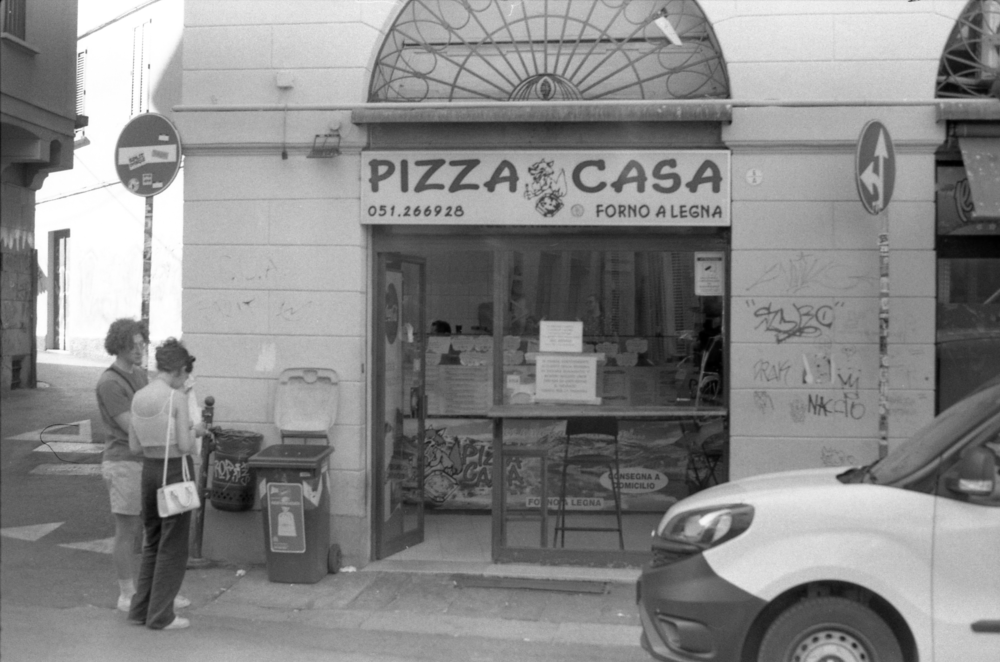

Fino al 2022 non avevo mai considerato la fotografia analogica un hobby particolarmente "attraente". Da qualche anno pensavo di acquistare una mirrorless, ma non ero mai andato oltre l’idea. Capivo a grandi linee il funzionamento delle macchine fotografiche – la luce catturata dal sensore, i meccanismi di base – ma non mi ero mai davvero interessato.

In quel periodo studiavo a Bologna e condividevo l’appartamento con un caro amico, Andrea. Un giorno, Andrea si presenta in casa con una reflex Konica. Non ricordo con precisione il modello, forse un’Autoreflex. La guardo incuriosito: non era la prima volta che tenevo in mano una macchina fotografica a rullino, ma questa volta decido di provare. Carico la pellicola e scatto. Mi piace subito la sensazione che restituisce: la manualità, il gesto di caricare ogni singolo fotogramma. Però, per qualche settimana, tutto si ferma lì.

Un giorno, mentre ero a casa mia, mi torna in mente che da bambino mio padre ci scattava foto con una macchina a rullino. Frugo un po’ e riesco a trovarla: una Yashica FX-3 del 1979 con un obiettivo 50mm f/2. Entusiasta, provo subito a caricarla e scattare, ma il mio entusiasmo si spegne rapidamente: il meccanismo di caricamento non funzionava correttamente. Non mi arrendo e, tornato a Bologna, riesco a trovare un fotoriparatore che la rimette in sesto.

Da quel momento inizia la mia avventura nel mondo della fotografia analogica. Compro il mio primo rullino, un Ilford, e scatto le mie prime 24 pose.

All'inizio non avevo molto chiare le basi della fotografia: il concetto di profondità di campo, il legame con il diaframma e i tempi di scatto. Andavo ad intuito: impostavo 1/125 perché mi era stato consigliato, regolavo il diaframma controllando le lucine dentro al mirino (l'esposimetro), mettevo a fuoco e scattavo.

Passano i mesi ed Andrea è sempre più preso da questo hobby, e io lo seguo a ruota. Ad un certo punto compra una [Lab-Box](https://www.ars-imago.com/lab-box), un "sistema" per sviluppare i rullini b/n a casa senza troppi impicci: carichi il rullino, inserisci la chimica di sviluppo e, per una decina di minuti, devi girare una manovella che distribuisce il liquido su tutta la pellicola.

Il primo rullino sviluppato non è venuto benissimo, con qualche alone, ma i fotogrammi c'erano! Era impressionante vederli controluce e non su uno schermo. Compro uno scanner piano con il portanegativi e così il cerchio si chiude. Scattavamo, sviluppavamo e scansionavamo da soli. Quel mix di attesa e sorpresa, il dover aspettare per vedere i risultati, mi conquista completamente.

La FX-3 è stata la macchina entry-level più venduta dalla Yashica, rimanendo in produzione dal 1979 fino al 2002. Questo dato parla già della bontà del progetto: una reflex completamente manuale, con l’elettronica limitata al solo esposimetro. La macchina ti obbliga a riflettere: ogni scatto richiede una preparazione attenta, con regolazioni precise e una composizione studiata.

A quei tempi, la Contax, un marchio noto per le sue fotocamere e obiettivi di alta qualità, attraversava un periodo difficile e cercava di rilanciarsi. Per questo motivo, affidò la produzione delle sue fotocamere alla Yashica, un'azienda giapponese in forte crescita. In quel periodo, le case giapponesi stavano guadagnando terreno sul mercato internazionale, erodendo il monopolio delle fabbriche tedesche. Questa collaborazione portò alla creazione del sistema di innesto Y/C (Yashica/Contax), un attacco che permetteva di utilizzare le prestigiose ottiche premium della serie T* di Contax sulle fotocamere prodotte da Yashica. 

Questa caratteristica rende la FX-3 una fotocamera estremamente versatile. Presto metto le mani su un Carl Zeiss 50mm f/1.7 e me ne innamoro: ancora oggi è l’ottica migliore che possiedo. Scopro che negli anni '60, '70 e '80 gli obiettivi avevano un loro "carattere". Gli schemi ottici non raggiungevano la precisione assoluta dei modelli attuali, ma proprio questa imperfezione donava a ogni lente una personalità unica. Molto spesso il "carattere" si manifestava nel bokeh a diaframma aperto, regalando sfumature e dettagli inconfondibili. Questa particolarità mi spinge a cercare e collezionare più obiettivi, ciascuno capace di offrire un’esperienza fotografica diversa.

Se ripenso al mio percorso, non avrei mai immaginato quanto la fotografia analogica potesse trasformarsi in una passione così intensa.
La fotografia analogica non è solo un hobby, ma un viaggio fatto di manualità, riflessione e scoperta, un dialogo costante tra il fotografo e il suo strumento. E questo, forse, è il suo fascino più grande.